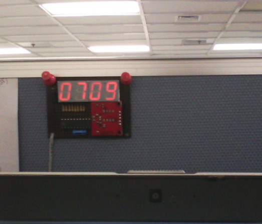
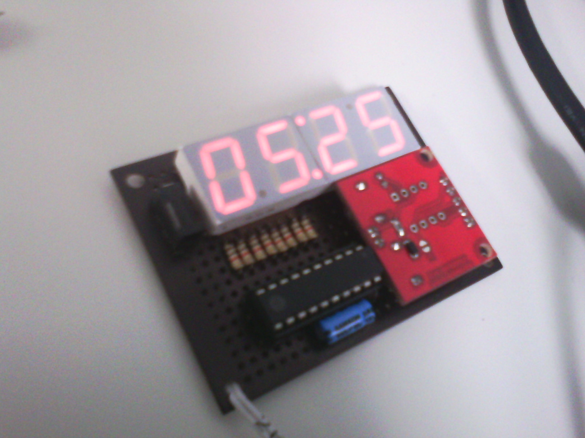
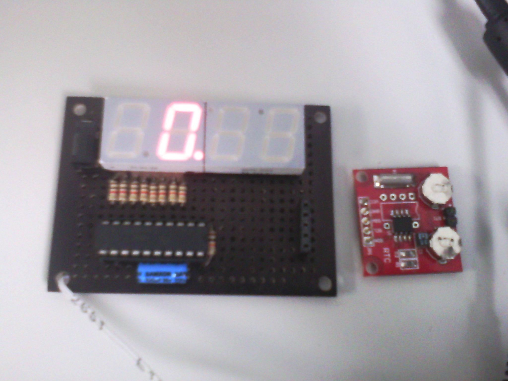

# bareboneClock

Here's a quick and simple digital clock you can pin to your cubicle wall. Good conversation piece and tells you when its time to go home...

For the hardware: I used a tiny2313 (you can use any tiny with at least 14 IO's), resistors, 7segment (4digits) and an RTC (DS1307) module. The module docks into a 5-pin socket so its removable for programming. I assembled them all in a proto board. I painted the board with black marker to give it a professional look ;). Power is provided by USB port (I used one from my loptop docking station)...

For the firmware: The mcu runs on 1MHz internal osc. Every second, RTC data is read via I2C (RTC time is pre-programmed separately using an arduino...). Taking the hour and minute data only, it is then separated for each 7segment digit. The digits are then cycled with 60Hz refresh rate (60Hhz x 4 or ~42ms interval between digit enable). We have interrupt on digit refresh timer, so we can spend most of the time sleeping... The seconds timer (for RTC read) is actually just a counter incremented with the digit refresh isr. The colon led is toggled every second.

With tiny 2313, you still have bytes of memory left and 3 IO's spare... With this you can still add a peizo speaker and play some funky tune when clock hits the hour or something like that...

MDF  
Nov 2013  

